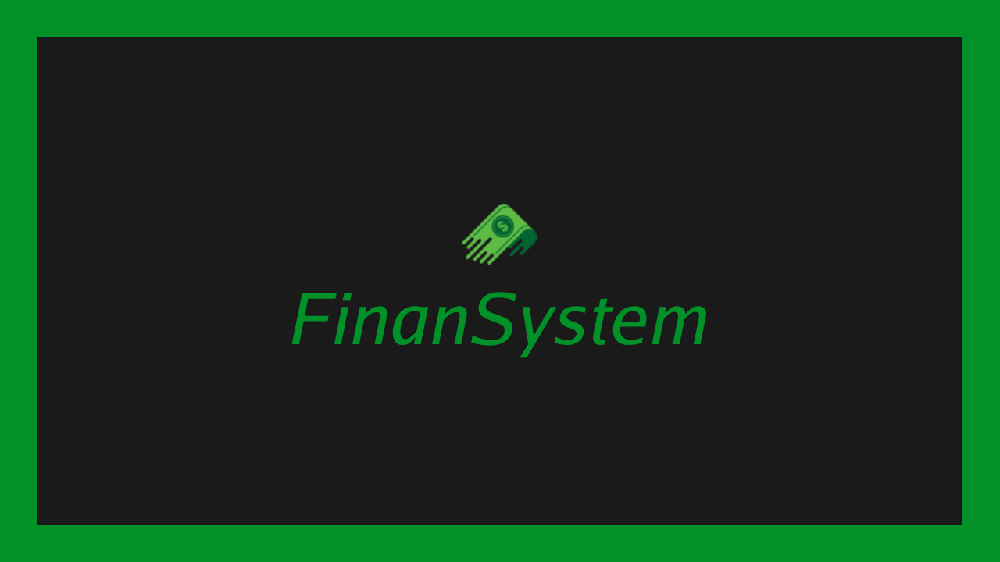

# Finansystem



## Overview
**Finansystem** is a web application for managing personal finances. It allows users to register income and expenses, providing a comprehensive dashboard to visualize financial data. Designed for simplicity and usability, **Finansystem** helps users stay on top of their financial health. 

You can explore the live application at [Finansystem](https://finansystem.vercel.app/).

## Features
- Add and categorize income and expenses.
- View a dashboard summarizing financial data.
- Simple and intuitive user interface.
- Responsive design for seamless use on all devices.

## Technologies Used
<table align="left" height="255px">
  <tr>
    <td align="center">
      <a href="https://developer.mozilla.org/en-US/docs/Web/HTML/">
        <br/>
        <sub>
          <b>
            <pre>React</pre>
          </b>
        </sub>
      </a>
    </td>
    <td align="center">
      <a href="https://developer.mozilla.org/en-US/docs/Web/JavaScript/">
        <br/>
        <sub>
          <b>
            <pre>Javascript</pre>
          </b>
        </sub>
      </a>
    </td>
    <td align="center">
      <a href="https://styled-components.com/">
        <br/>
        <sub>
          <b>
            <pre>Styled Components</pre>
          </b>
        </sub>
      </a>
    </td>
  </tr>
</table>
<br/><br/><br/><br/><br/><br/><br/><br/>

## Getting Started
1. Clone the repository:
   ```bash
   git clone https://github.com/leonardohernandesq/finansystem.git
   ```
2. Install dependencies:
   ```bash
   npm install
   ```
3. Start the development server:
   ```bash
   npm start
   ```

Visit the live site at [Finansystem](https://finansystem.vercel.app/).
